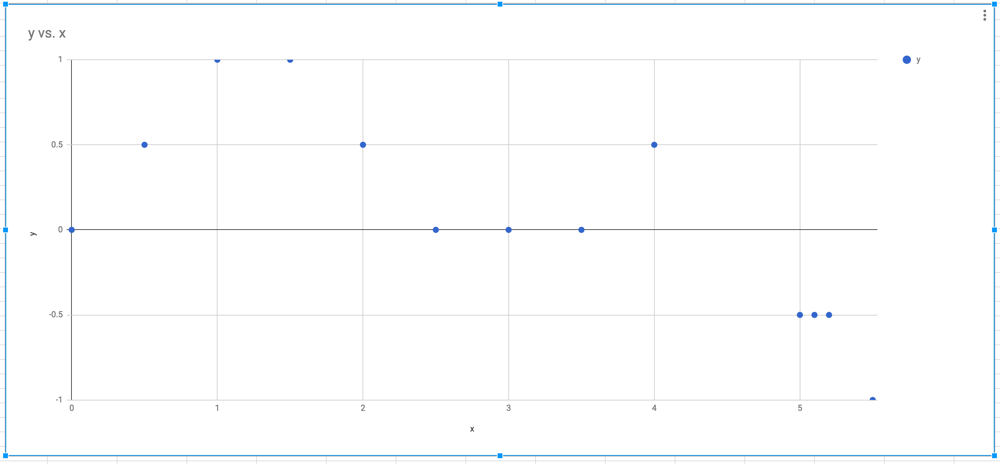
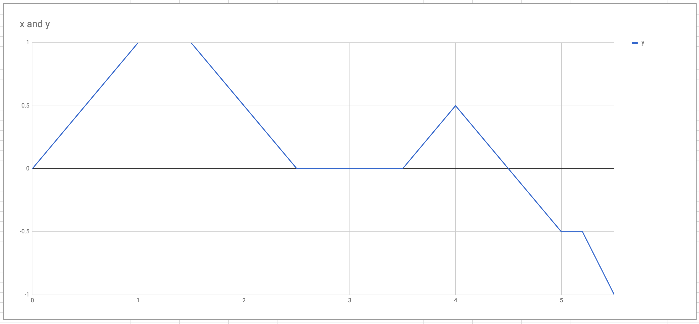
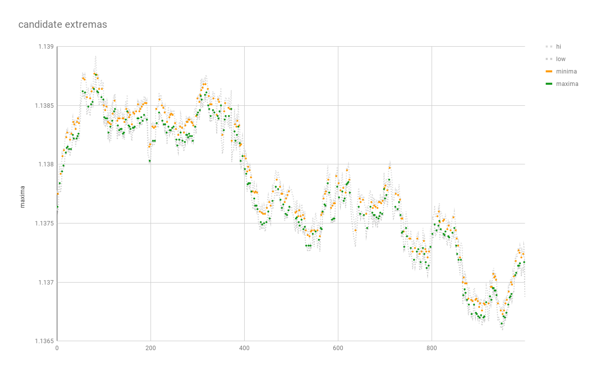

# spark-local-extrema
Algorithm to that find local extrema using spark.

[](https://travis-ci.org/thomashan/spark-local-extrema)

# Simple cartesian points
## Assumption
* all points are differentiable (e.g. it has not duplicate points in the same x axis)

## Scenarios
The easiest calculation is when the differentiation changes signs.
* +ve -> -ve
* -ve -> +ve

The other cases are
* +ve -> any number of 0's -> -ve
* -ve -> any number of 0's -> +ve
* +ve -> any number of 0's -> +ve
* -ve -> any number of 0's -> -ve

### Simple cases

## Test dataset
Test data is available in csv format in
`src/test/resources/data/cartesian_points.csv`

| x   | y    |
|-----|------|
| 1.5 | 1    |
| 5.2 | -0.5 |
| 0   | 0    |
| 1   | 1    |
| 2.5 | 0    |
| 5.1 | -0.5 |
| 4   | 0.5  |
| 0.5 | 0.5  |
| 3   | 0    |
| 5.5 | -1   |
| 5   | -0.5 |
| 3.5 | 0    |
| 2   | 0.5  |


This data looks random and is not sorted.

The scatter plot for this data is in
`images/cartesian_points_scatter_plot.png`


The data has to be sorted to plot the line chart.
You can see the line chart in
`images/cartesian_points_line_chart.png`


You can see there are local extrema in the following points
* (1, 1), (1.5, 1) maxima
* (2.5, 0), (3, 0), (3.5, 0) minima
* (4, 0.5) maxima

ExtremaSetTaskSpec has tests that uses this dataset.

## Example dataset
An example dataset is available in
`examples/random.csv`
To read more about how we got this data please read [examples/README.md](examples/README.md)

You can run the extrema against this dataset by running
```bash
> sbt assembly
> docker run --rm -it -p 4040:4040 \
-v $(pwd)/examples:/data \
-v $(pwd)/target/scala-2.11/spark-local-extrema-assembly-0.1-SNAPSHOT.jar:/job.jar \
gettyimages/spark bin/spark-submit \
--master local[*] \
--driver-memory 2g \
--class com.github.thomashan.spark.cartesian.extrema.CompleteDatasetJob /job.jar \
/data/random.csv true x y /data/random_extrema
```

This will create directory named `examples/random_extrema` which contains the csv file of the extrema.

The plot of the first 200 points can be seen in 
`images/first_200_points.png`


# Complex dataset (high-low time series)
In this section we find the local extrema for more complex dataset (e.g. bid/ask time series dataset).
The extrema can be use to find the exact peaks and troughs of financial dataset (foreign exchange, stock, futures, derivatives, bond, commodities, etc). 

## Rules
Simple rules like looking at the diff transitions from +ve -> -ve or -ve -> +ve does not apply to high-low time series data.
The low point of the maxima has to be greater than all surrounding highs to be to considered maxima and conversely 
the highest point of the minima has to be less than all the surrounding lows to be considered minima. 

* a point is considered a maxima if the low point is greater than the surrounding highs
* a point is considered a minima if the high point is less than the surrounding lows

## Scenarios
The easiest calculation is when the differentiation changes signs.
* +ve -> -ve and low is greater than surrounding lows
* +ve -> -ve and low is greater than surrounding highs

## Test dataset
Test data is available in csv format in
`src/test/resources/data/hi_low.csv`
It contains 1000 rows of high-low time series data.

| x     | hi      | low     |
| ----- | ------- | ------- |
| 0.0   | 1.13776 | 1.13761 |
| 1.0   | 1.13778 | 1.13764 |
| 2.0   | 1.13775 | 1.1376  |
| 3.0   | 1.13778 | 1.13762 |
| 4.0   | 1.13794 | 1.13779 |
| 5.0   | 1.13796 | 1.13781 |
| 6.0   | 1.13799 | 1.13784 |
| 7.0   | 1.13793 | 1.13776 |
| 8.0   | 1.13792 | 1.13777 |
| 9.0   | 1.13795 | 1.13779 |
| ...   | ...     | ...     |

The plot of the test data is be seen in `images/high_low_time_series.png`


# High-low extrema

## Candidate extrema
To find the extrema in high-low time series data the first step is to differentiate hi-low point to find the extrema candidates.
The high point can only be extrema for the minimum (trough) and the low point can only be extrema for the maxima (peak).

We filter out differentiated value of 0 and find all the cross overs where the differentiated value goes from +ve -> -ve or -ve -> +ve.

The candidate extrema can be seen in the plot below.
`images/high_low_candidate_extrema.png`


## Remove duplicate extrema
You will notice the duplicate extrema occurring such as x=23.0 and x=26.0 in `src/test/resources/data/hi_low_candidate_extrema_set.csv`.
We need to get rid of the duplicate set and reduce it down to a single value.
The following rules apply for reducing the duplicate extrema to a single value.
* minima: reduce duplicates to a single lowest high value
* maxima: reduce duplicates to a single highest low value

The candidate extrema with extrema deduplicated can be seen in the plot below.
`images/high_low_candidate_extrema_deduplicated.png`


## Remove false candidate extrema
The next step is to remove false candidate extrema. 
This is a two phase process. After removing the duplicate extrema it will always form a sequence of extrema that will alternate (i.e maxima -> minima -> maxima -> minima -> ...).

For given sequence of extrema - minima (min0) -> maxima (max0) -> minima (min1), the following rules apply
* if min0_high < max0_low and min1_high < max0_low keep min0 
* else if min0_high > min1_high discard min0
* else keep min0

The second phase is
* if min0_high < max0_low and min1_high < max0_low keep min1 
* else if min1_high > min0_high discard min1
* else keep min1

And conversely for sequence of extrema - maxima (max0) -> minima (min0) -> maxima (max1)
* if max0_low > min0_high and max1_high < min0_high keep max0 
* else if max0_low < max1_low discard max0
* else keep max0

The second phase
* if max0_low > min0_high and max1_high < min0_high keep max1 
* else if max1_low < max0_low discard max1
* else keep max1

Remove the duplicate extrema as describe in previous section.

This process is repeated until we can't remove and more points.

*Pass 1*


*Pass 2 (final pass)*

